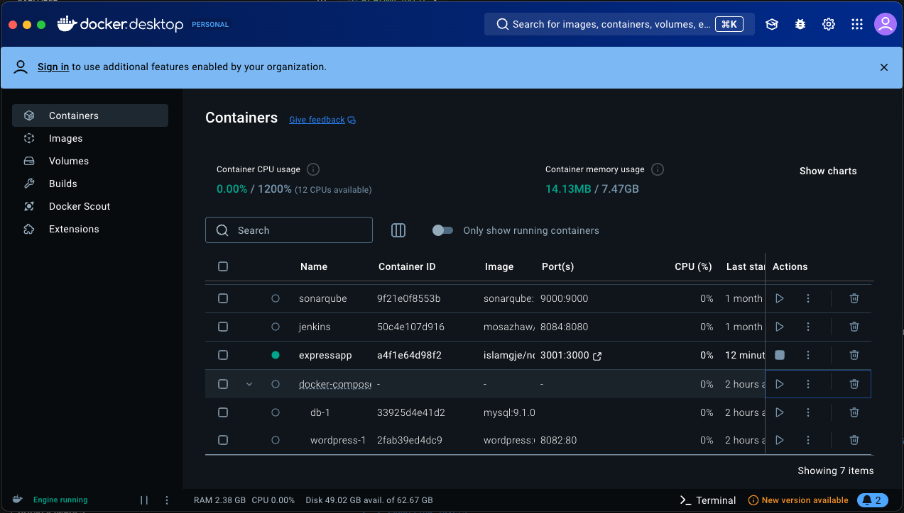

# DevOpsNodeWebApp

Zunächst habe ich den Text angepasst in der server.js Datei und dann das Image gebaut: 

Dann habe ich das Image gestartet und im Browser überprüft:

Auf Docker war der Erfolg auch zu sehen: 

Ausserdem habe ich meine eigene App aus DevOpsDemo gebaut, lokal deployet und im Browser geöffnet: 

